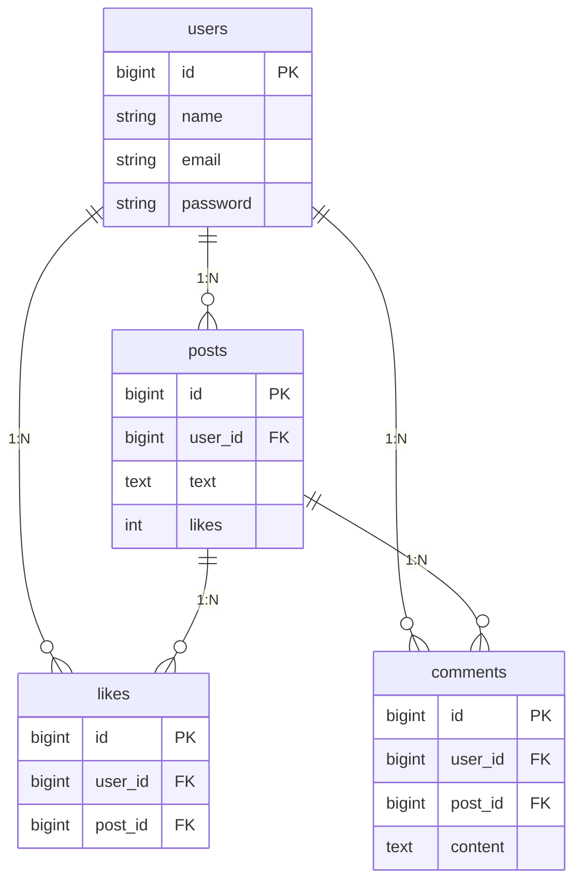

```mermaid
erDiagram
    users ||--o{ posts : "1:N"
    users ||--o{ likes : "1:N"
    users ||--o{ comments : "1:N"
    posts ||--o{ likes : "1:N"
    posts ||--o{ comments : "1:N"

    users {
        bigint id PK
        string name
        string email
        string password
    }

    posts {
        bigint id PK
        bigint user_id FK
        text text
        int likes
    }

    comments {
        bigint id PK
        bigint user_id FK
        bigint post_id FK
        text content
    }

    likes {
        bigint id PK
        bigint user_id FK
        bigint post_id FK
    }
```
